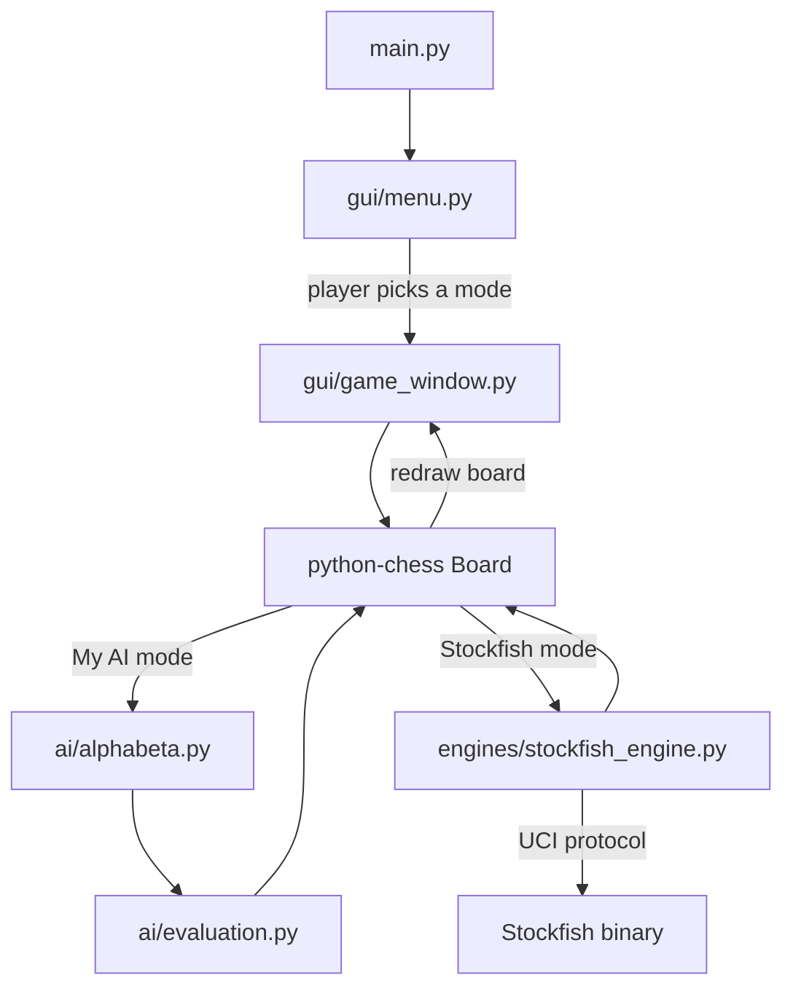

# Meem Chess

Play chess against an AI you can actually see the source code of — or against Stockfish, one of the strongest chess engines in the world, tuned down to three human-feeling difficulty levels. Meem Chess is a Python desktop app with a full graphical board, built on top of the [python-chess](https://python-chess.readthedocs.io/) rules engine and a hand-written Alpha-Beta search AI.


-8a3ffc.svg)


---

## Table of Contents

- [Overview](#overview)
- [Preview](#preview)
- [Features](#features)
- [How the AI Works](#how-the-ai-works)
- [Architecture](#architecture)
- [Project Structure](#project-structure)
- [Tech Stack](#tech-stack)
- [Getting Started](#getting-started)
- [How to Play](#how-to-play)
- [Difficulty Levels](#difficulty-levels)
- [Known Limitations](#known-limitations)
- [Roadmap](#roadmap)
- [Contributing](#contributing)
- [License](#license)
- [Acknowledgments](#acknowledgments)

---

## Overview

Meem Chess is a personal AI project built to explore how a chess engine actually works, end to end — not just calling a library, but writing the search and evaluation logic myself and then benchmarking it against the real thing.

The app gives you four ways to play:

- **My AI** — a from-scratch Alpha-Beta pruning engine with move ordering and a piece-square-table evaluation function
- **Stockfish Easy / Medium / Hard** — the actual Stockfish engine, running locally and tuned to three distinct strength levels

Everything runs in a clean, dark-themed desktop GUI built with CustomTkinter, with full rule enforcement (legal moves, check, checkmate, stalemate, draws) handled by `python-chess`.

The whole project is ~1,400 lines of Python across the GUI, the AI, and the Stockfish bridge.

## Preview

<p align="center"><em>Starting position, rendered with the app's actual board colors and piece set.</em></p>

> 📸 **
 ** A shot of the main menu, a mid-game board, and the game-over popup will make this section much more compelling than the static preview above. Drop them in the repo (e.g. `docs/screenshot-menu.png`) and reference them with ``.

## Features

- **Four play modes** — your own Alpha-Beta engine, or Stockfish at Easy, Medium, or Hard
- **Full rules engine** via `python-chess`: legal move generation, castling, en passant, pawn promotion, check/checkmate/stalemate detection, and draw detection (insufficient material, 75-move rule, fivefold repetition, claimable draws)
- **Click-to-move board** with legal-move highlighting — dots for quiet moves, rings for captures — and a red outline around a king in check
- **Live move history** in standard algebraic notation (`1. e4 e5  2. Nf3 Nc6 ...`)
- **Captured-piece tracker** for both sides
- **Undo, Flip Board, New Game, Resign, and Main Menu** controls
- **Non-blocking AI** — the search runs on a background thread with a live "AI thinking… 1.4s" timer, so the window never freezes while the engine calculates
- **Scrollable side panel** so controls never get clipped on small or resized windows
- **Graceful Stockfish fallback** — if the Stockfish binary isn't found, the app automatically switches to My AI and tells you why, instead of crashing
- **Dark, modern UI** built with CustomTkinter

## How the AI Works

### My AI — Custom Alpha-Beta Engine

This is the part of the project that's genuinely "my AI" rather than a wrapper around someone else's engine. It lives in `ai/alphabeta.py` and `ai/evaluation.py`:

- **Search algorithm**: minimax with Alpha-Beta pruning, searching 3 ply ahead by default (`get_best_move(board, depth=3)`). Alpha-Beta discards branches that can't possibly affect the final decision, so the engine explores far fewer positions than brute-force minimax while still returning the exact same move.
- **Move ordering**: before searching, legal moves are sorted so captures are checked before quiet moves — and among captures, taking a high-value piece with a low-value piece is checked first (e.g. pawn-takes-queen before queen-takes-pawn). This doesn't change which move is chosen, but it lets Alpha-Beta prune far more aggressively, which is the main reason the engine feels fast.
- **Evaluation function** (`evaluate()` in `ai/evaluation.py`): scores a position using
  - standard material values (Pawn 100, Knight 320, Bishop 330, Rook 500, Queen 900), and
  - piece-square tables for every piece type — 64-square bonus/penalty grids that encode classic positional chess knowledge (e.g. knights are weak on the rim, advance your pawns, keep the king tucked away early on).
- Checkmate and stalemate are detected as terminal states and scored directly, rather than estimated.

### Stockfish Integration

`engines/stockfish_engine.py` wraps the real Stockfish binary using `python-chess`'s built-in `chess.engine` module, which speaks the UCI protocol directly — **not** the separate `stockfish` PyPI package. Three difficulty presets combine several UCI knobs at once (see the [Difficulty Levels](#difficulty-levels) table below):

- **Skill Level** (0–20, Stockfish's own native strength knob)
- **UCI_LimitStrength + UCI_Elo**, so "Easy" doesn't just search shallower, it actually targets a lower rating
- **Time and depth caps** per move
- A **simulated blunder chance** — on Easy and Medium, Stockfish occasionally plays a random legal move instead of its best one. Without this, even a "weak" Stockfish still calculates flawlessly within its depth limit and doesn't feel beatable; the blunder chance is what makes the lower difficulties feel human.

If the engine process can't be started (binary missing, bad path, etc.), `is_available()` returns `False` and the GUI transparently falls back to My AI.

## Architecture



The board state, legal moves, and end-of-game rules all live inside a single `chess.Board` object from `python-chess`. The GUI layer never implements chess rules itself — it draws whatever the board object reports and asks it whether a clicked move is legal. When it's the AI's turn, `GameWindow` hands the board to either the local search (`ai/alphabeta.py`) or the Stockfish wrapper, on a background thread, and applies whatever move comes back.

## Project Structure

```
Meem-Chess/
├── main.py                # Entry point — launches the main menu
├── requirements.txt       # Python dependencies
├── gui/
│   ├── menu.py            # Main menu screen (mode selection)
│   └── game_window.py     # Board rendering, click handling, move/game logic
├── ai/
│   ├── alphabeta.py       # Alpha-Beta search + move ordering
│   └── evaluation.py      # Position scoring (material + piece-square tables)
├── engines/
│   └── stockfish_engine.py # Stockfish UCI wrapper + difficulty presets
└── assets/
    ├── pieces/            # 12 piece sprites (wp...wk, bp...bk)
    └── stockfish.exe      # NOT included — see "Setting Up Stockfish" below
```

## Tech Stack

| Layer | Library / Tool |
|---|---|
| Language | Python 3 |
| Chess rules & board state | [`python-chess`](https://python-chess.readthedocs.io/) |
| GUI framework | [`CustomTkinter`](https://github.com/TomSchimansky/CustomTkinter) (on top of Tkinter) |
| Image handling | [`Pillow`](https://python-pillow.org/) |
| Chess engine (optional) | [Stockfish](https://stockfishchess.org/) via the UCI protocol |
| Concurrency | Python `threading` (keeps AI search off the GUI thread) |

## Getting Started

### Prerequisites

- Python 3.9 or newer
- On Linux, Tkinter's system package if it isn't already installed: `sudo apt-get install python3-tk`

### Installation

```bash
git clone https://github.com/<your-username>/Meem-Chess.git
cd Meem-Chess
pip install -r requirements.txt
```

### Setting Up Stockfish

> ⚠️ **`assets/stockfish.exe` is intentionally excluded from this repository.** Engine binaries are large, platform-specific, and distributed separately from this project's code, so it's left out of version control (see `.gitignore`) and needs to be added manually.

1. Download Stockfish for your OS from [stockfishchess.org/download](https://stockfishchess.org/download/).
2. Place the executable inside the `assets/` folder, named:
   - `stockfish.exe` on Windows
   - `stockfish` on macOS/Linux
3. Open `engines/stockfish_engine.py` and update the `STOCKFISH_PATH` constant near the top of the file to point at wherever you placed it, e.g.:
   ```python
   STOCKFISH_PATH = r"C:\path\to\Meem-Chess\assets\stockfish.exe"
   ```
   This path is currently hardcoded to the original developer's machine, so **this step is required** before any of the three Stockfish modes will work on a different computer — including a fresh clone of this repo.

If you skip this step, the app still runs fine: it detects that Stockfish isn't available, automatically falls back to **My AI**, and shows a popup explaining why.

### Running the App

```bash
python main.py
```

## How to Play

1. Launch the app and pick a mode from the main menu: **My AI (Alpha-Beta)**, **Stockfish Easy**, **Stockfish Medium**, or **Stockfish Hard**.
2. You always play as **White** and move first.
3. Click a piece to select it — legal destinations are highlighted (a dot for a quiet move, a ring for a capture) — then click a destination to move.
4. Pawns reaching the last rank always promote to a Queen automatically.
5. Use the side panel to **Undo**, **Flip Board** (just rotates the view — you're still playing White), start a **New Game**, **Resign**, or return to the **Main Menu**.

## Difficulty Levels

| Mode | Target ELO | Skill Level | Think Time | Search Depth | Blunder Chance |
|---|---|---|---|---|---|
| 🟢 Stockfish Easy | ~800 | 0 | 0.05s | 1 ply | 40% |
| 🟠 Stockfish Medium | ~1500 | 3 | 0.2s | 3 ply | 15% |
| 🔴 Stockfish Hard | ~2500+ | 10 | 0.8s | 8 ply | 0% |

*Blunder chance is the probability that, instead of playing its calculated best move, the engine plays a random legal move — this is what keeps Easy and Medium feeling beatable rather than just "a strong engine playing slightly worse."*

`My AI` has no difficulty tiers yet — it always searches 3 ply deep.

## Known Limitations

- **Stockfish path is hardcoded** to the original developer's machine (see [Setting Up Stockfish](#setting-up-stockfish)) — it must be edited manually rather than being auto-detected.
- **You can only play as White.** Flipping the board changes the view, not which side you control.
- **No underpromotion** — pawns reaching the last rank always become a Queen; there's no UI to choose a Rook, Bishop, or Knight instead.
- **Undo is fully symmetric only in My AI mode** (it takes back both the AI's reply and your move, so it's your turn again). In the Stockfish modes, Undo currently removes only Stockfish's last reply.
- **My AI's search depth (3 ply) is fixed in code**, not adjustable from the UI.
- **No save/load** — there's no PGN export or ability to resume a game after closing the app.

## Roadmap

Ideas for where this could go next:

- [ ] Auto-detect the Stockfish binary (check `assets/` and `PATH`) instead of a hardcoded path
- [ ] Let the player choose to play as Black
- [ ] Adjustable "My AI" search depth from the UI
- [ ] Underpromotion support (choose Rook/Bishop/Knight)
- [ ] PGN export and save/load games
- [ ] Iterative deepening + a transposition table, for a faster and deeper "My AI" search
- [ ] Opening book for "My AI"
- [ ] Move sound effects / animations

## Contributing

This started as a solo learning project, but issues, suggestions, and pull requests are welcome — whether that's a bug report, a cleaner evaluation function, or a UI tweak.

1. Fork the repo
2. Create a branch (`git checkout -b feature/my-idea`)
3. Commit your changes
4. Open a pull request

## License

No license has been set for this project yet. Until one is added, all rights are reserved by default. If you plan to share this publicly or accept contributions, consider adding a license — [choosealicense.com](https://choosealicense.com/) is a good place to start (MIT is a common, permissive choice for portfolio projects).

## Acknowledgments

- [Stockfish](https://stockfishchess.org/) — the open-source chess engine this project plays against
- [python-chess](https://python-chess.readthedocs.io/) by Niklas Fiekas — move generation, rules, and UCI engine communication
- [CustomTkinter](https://github.com/TomSchimansky/CustomTkinter) by Tom Schimansky — the modern widget set on top of Tkinter
